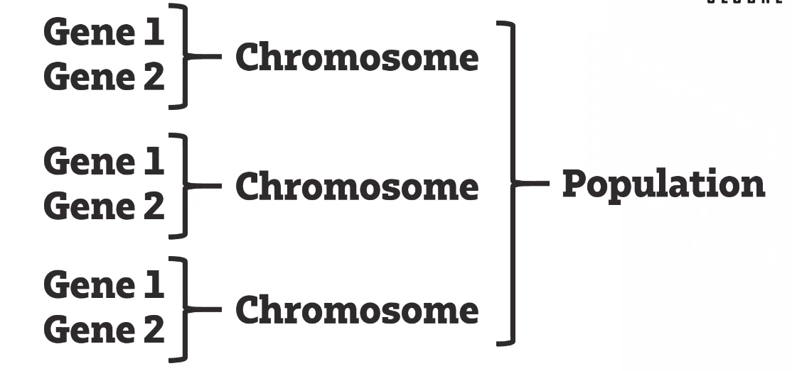

# Bot programming

### Useful info
- Write an action using print
``` to debug: print("Debug messages...", file = sys.stderr, flush = True)```
- every possible game move must be in while loop
- every possible game move must be generated from the same while loop
- can install plug in for external code editors if needs

## Genetic algorithms
- Train bot to hit ball at target
  - control power 
  - control angle
- could code them as a chromosome:
  - gene1
  - gene2

- need a fitness function/ evaluation metric
- **gene selection**:
  - take two chromosomes with highest evaluation score
  - can also take another 2 random ones
  - then have genetic crossover
  - get your new population, ditch old generation
- good to introduce level of randomness
- Can stop when we reach an answer if there is one, if not continue mutating

## bot programming
- evaluation function based on teh board state
- maximise score for your next move
- maximise score for N moves ahead
- maximise score based on opponents moves ALSO generated by genetic algoristhms
- **hint**: read post mortems of previous bot programming comps 

### 2020 challenge
- witch brewing potions trying to earn more money than witch sister
- fullfill contract for it to go away
- have inventory

- Brew a potion
- Cast a spell
- Rest and recover
- Learn new spells

#### applying genetic algorithm
- each gene is a move
- chromosome is a sequential string of moves

